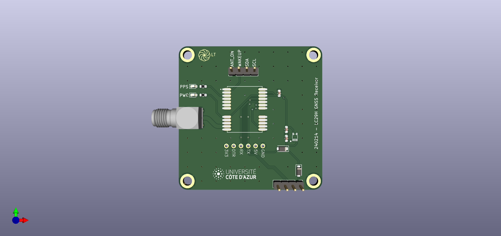

# LC29H_Basic_GNSS_Receiver
> A Basic GNSS Receiver board using a Quectel LC29H, dual-band GNSS module.

## Description
This circuit is a simple demonstration board for Quectel LC29H series GNSS module. It incorporate a Serial-to-USB sub-circuit and as an SMA connector for the antenna. All the pins of the module are broken out to 2.54mm headers except for the bias-tee part.
The dimensions are 50x50 mm on a standard 1.6mm FR-4 PCB substrate.

A case has been designed (for 3D printing) to protect the circuit board.

## Hardware
The following hardware is needed to assemble this board:
  - GNSS module: Quectel LC29H (https://www.mouser.fr/ProductDetail/Quectel/LC29HAAMD?qs=doiCPypUmgGc92WNczocRA%3D%3D)
  - 3.3V LDO: STLQU20
  - Serial-to-USB: CH340 module (https://fr.aliexpress.com/item/1005004947889599.html)
  - Protection diodes: 1N4007
  - 100 nF decoupling capacitor, LED, 4.7K Resistor (0603)

Optional:
  - M3 insert (https://fr.aliexpress.com/item/1005003582355741.html)
  - M3 srew, 3D printer

## PCB design
The schematic and the layout are done using KiCAD and are availabe in Design_files/LC29H_basic_GNSS_Receiver_v1.0.zip.
Here is a visualization of the PCB:

  

The case design is available as 2 separate objects: the top and bottom of the case in .STL format. These files are available in Design_files/240328_GNSS_Rx_enclosure.